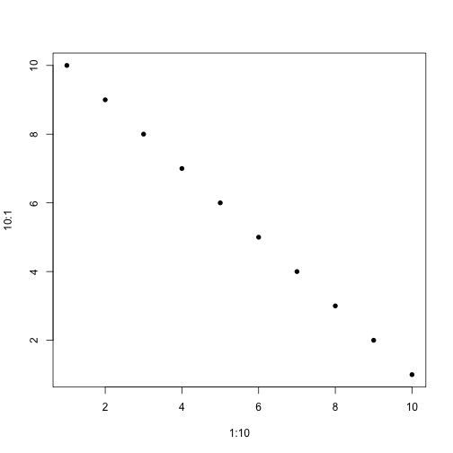

```r
library("reshape")
library("ggthemes")
```

```
## Loading required package: ggplot2
```

```r
library("wesanderson")
pal <- wes.palette(name = "Zissou", type = "continuous")

df <- melt(data.frame(id = 1:10, matrix(rnorm(1:100), ncol = 10)), id.vars = "id")
ggplot(data = df, aes(x = id, y = variable, fill = value)) + geom_tile(color = "white") + 
    scale_fill_gradientn(colours = pal(10)) + theme_tufte()
```

 

