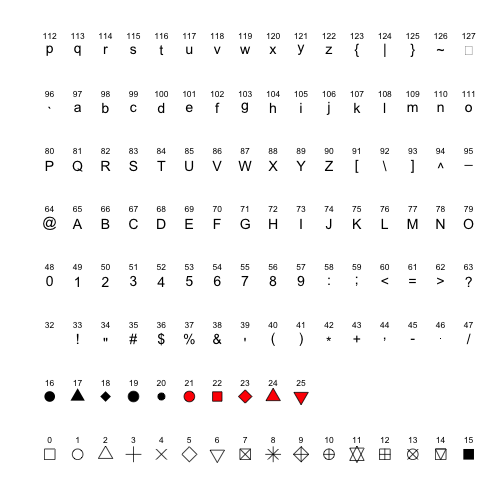

* All kind of shapes


```r
library("ggplot2")
library("ggthemes")
d <- data.frame(p = c(0:25, 32:127))
ggplot() + scale_y_continuous(name = "") + scale_x_continuous(name = "") + scale_shape_identity() + 
    geom_point(data = d, mapping = aes(x = p%%16, y = p%/%16, shape = p), size = 5, 
        fill = "red") + geom_text(data = d, mapping = aes(x = p%%16, y = p%/%16 + 
    0.25, label = p), size = 3) + theme_tufte(ticks = FALSE) + theme(axis.text = element_blank())
```

```
## Warning: largeur de police inconnue pour le caractère 0x7f
## Warning: taille de police inconnue pour le caractère 0x7f
```

 


