```r
library(rgdal)
```

```
## Loading required package: sp
## rgdal: version: 0.8-16, (SVN revision 498)
## Geospatial Data Abstraction Library extensions to R successfully loaded
## Loaded GDAL runtime: GDAL 1.9.2, released 2012/10/08
## Path to GDAL shared files: /Library/Frameworks/R.framework/Versions/3.0/Resources/library/rgdal/gdal
## Loaded PROJ.4 runtime: Rel. 4.8.0, 6 March 2012, [PJ_VERSION: 480]
## Path to PROJ.4 shared files: /Library/Frameworks/R.framework/Versions/3.0/Resources/library/rgdal/proj
```

```r
library(ggplot2)
library(maptools)
```

```
## Checking rgeos availability: TRUE
```

```r
library(ggthemes)
library(rgeos)
```

```
## rgeos version: 0.3-4, (SVN revision 438)
##  GEOS runtime version: 3.3.3-CAPI-1.7.4 
##  Polygon checking: TRUE
```

```r
library("wesanderson")
pal <- wes.palette(name = "Zissou", type = "continuous")
# Data from http://thematicmapping.org/downloads/world_borders.php.  Direct
# link: http://thematicmapping.org/downloads/TM_WORLD_BORDERS_SIMPL-0.3.zip
# Unpack and put the files in a dir 'data'
world.map <- readOGR(dsn = "TM_WORLD_BORDERS_SIMPL-0.3/", layer = "TM_WORLD_BORDERS_SIMPL-0.3")
```

```
## OGR data source with driver: ESRI Shapefile 
## Source: "TM_WORLD_BORDERS_SIMPL-0.3/", layer: "TM_WORLD_BORDERS_SIMPL-0.3"
## with 246 features and 11 fields
## Feature type: wkbPolygon with 2 dimensions
```

```r
wg <- fortify(world.map, region = "ISO3")
```


```r
ggplot(data = wg, aes(x = long, y = lat, group = group)) + geom_polygon(color = "white") + 
    theme_tufte(ticks = FALSE) + labs(title = "Carte du monde") + theme(axis.text = element_blank(), 
    legend.position = "bottom", axis.title = element_blank()) + coord_map(xlim = c(-180, 
    180), ylim = c(-60, 90))
```

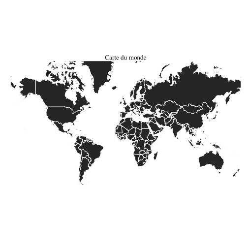 


```r
ggplot(data = wg, aes(x = long, y = lat, group = group, map_id = id)) + geom_map(color = "white", 
    map = wg) + theme_tufte(ticks = FALSE) + labs(title = "Carte du monde") + 
    theme(axis.text = element_blank(), legend.position = "bottom", axis.title = element_blank()) + 
    coord_map(xlim = c(-180, 180), ylim = c(-55, 90))
```

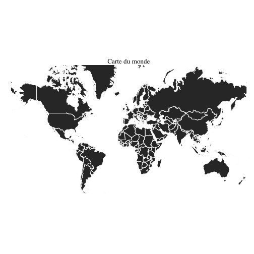 


## Projection 


```r
map <- ggplot(data = wg, aes(x = long, y = lat, group = group)) + geom_polygon(color = "white") + 
    theme_tufte(ticks = FALSE) + labs(title = "Carte du monde") + theme(axis.text = element_blank(), 
    legend.position = "bottom", axis.title = element_blank())
```


```r
map + coord_map(xlim = c(-180, 180), ylim = c(-55, 90))
```

 

```r
map + coord_map(xlim = c(-180, 180), ylim = c(-55, 90), projection = "mercator")
```

 

```r
map + coord_map(xlim = c(-180, 180), ylim = c(-55, 90), projection = "sinusoidal")
```

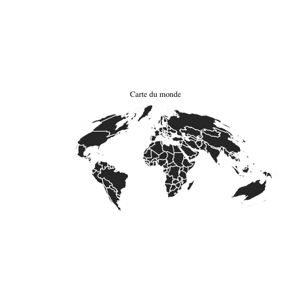 

```r
map + coord_map(xlim = c(-180, 180), ylim = c(-55, 90), projection = "cylindrical")
```

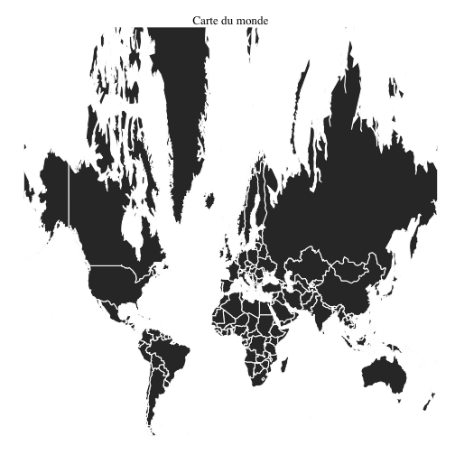 

```r
map + coord_map(xlim = c(-180, 180), ylim = c(-55, 90), projection = "rectangular", 
    lat0 = 46)
```

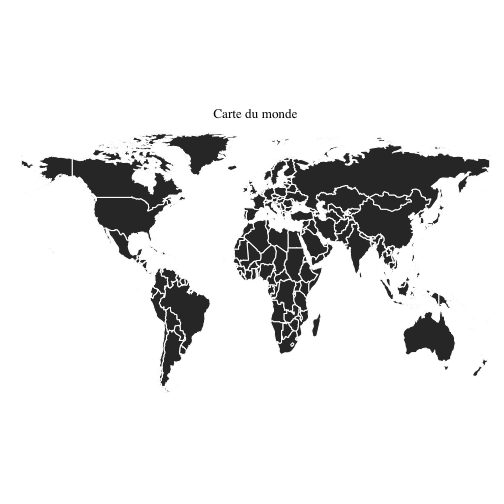 

```r
map + coord_map(xlim = c(-180, 180), ylim = c(-55, 90), projection = "gall", 
    lat0 = 46)
```

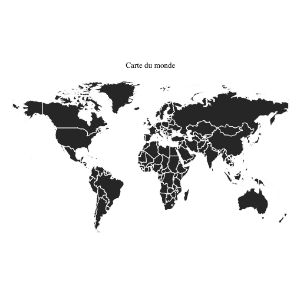 

```r
map + coord_map(xlim = c(-180, 180), ylim = c(-55, 90), projection = "mollweide")
```

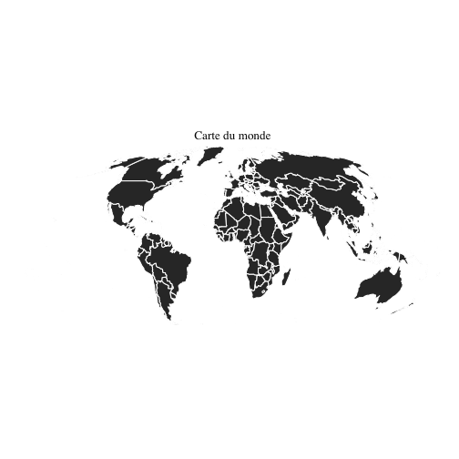 

```r
map + coord_map(xlim = c(-180, 180), ylim = c(-55, 90), projection = "gilbert")
```

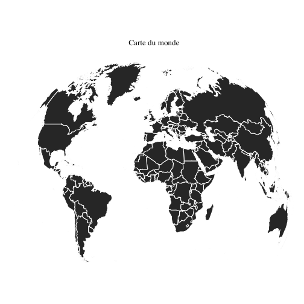 

```r
map + coord_map(xlim = c(-180, 180), ylim = c(-55, 90), projection = "perspective", 
    dist = 1)
```

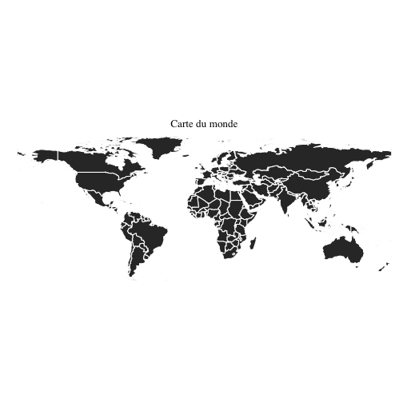 

```r
map + coord_map(xlim = c(-180, 180), ylim = c(-55, 90), projection = "orthographic")
```

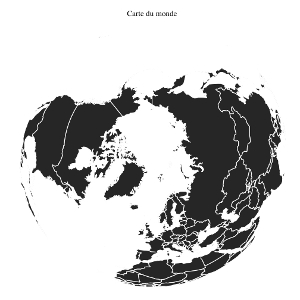 

```r
map + coord_map(xlim = c(-180, 180), ylim = c(-55, 90), projection = "globular")
```

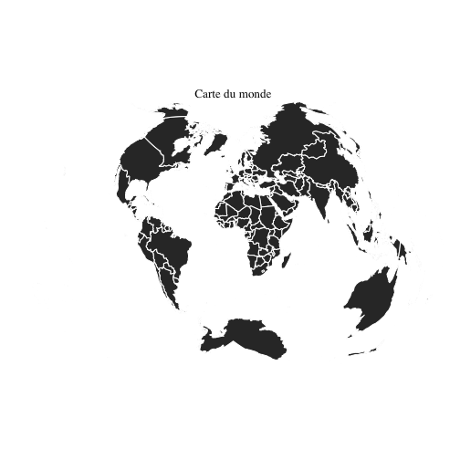 


## Problème avec la carte
* Problème avec le Groenland

```r
library(ggplot2)
library(maps)
world <- map_data("world")
ggplot() + geom_map(data = world, aes(x = long, y = lat, group = group, map_id = region), 
    colour = "white", fill = "grey10", map = world) + coord_map(xlim = c(-180, 
    180), ylim = c(-60, 90))
```

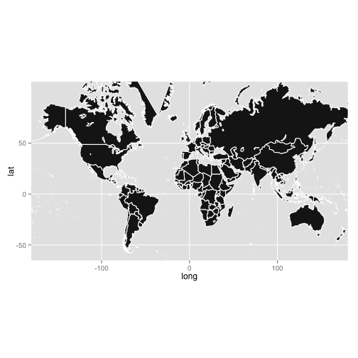 


